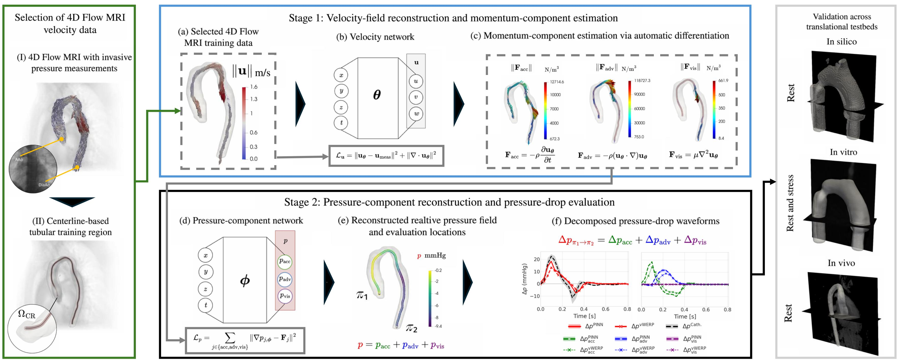

# PINN-Based Pressure Drop Estimation and Decomposition
Two-stage physics-informed neural networks for non-invasive aortic pressure-drop estimation and decomposition into acceleration, advection, and viscous contributions. Includes in silico CFD example.

<p align="center">
  <a href="docs/Graphical_Abstract.pdf">
    
  </a>
</p>

**Figure 1. Overview of the proposed pipeline for aortic pressure-drop estimation and decomposition.** The green panel on the left (“Selection of 4D Flow MRI velocity data”) illustrates the selection of velocity measurements within a centerline-based tubular region, $\Omega_{\mathrm{CR}}$, with the selected spatial locations retained across all available time frames to construct the training dataset. The blue panel located at the upper center show the Stage 1: the selected data (a) train a velocity network (b) using a data-fidelity term and an incompressibility constraint. Automatic differentiation of the reconstructed velocity field provides the accelerative, advective, and viscous momentum contributions (c). The black panel located at the lower center show the Stage 2: a pressure-component network (d) approximates the gradient-field projection of each momentum contribution by minimizing the mismatch between that contribution and the corresponding pressure-component gradient. The resulting scalar fields are combined into a relative pressure field (e), from which the pressure drop between the proximal and distal locations, $\pi_1$ and $\pi_2$, is evaluated and decomposed into its three contributions (f). The right grey panel illustrates validation across *in silico*, *in vitro*, and *in vivo* testbeds.


# In silico CFD cases

This repository includes code for processing data and visualizing the results of pressure drop estimation between proximal and distal points of the aorta. In silico cases with coarctations of 9, 11, and 13 mm are included, as well as the normal case (without coarctation). The first network learns a differentiable velocity representation by minimizing a physics-based loss function that combines data agreement and incompressibility, allowing for the evaluation of accelerated, advective, and viscous momentum terms through automatic differentiation. The second network learns the gradient field projection of each momentum term by minimizing the discrepancy between that term and the gradient of its corresponding predicted pressure component. The total pressure drop between proximal and distal locations is obtained as the sum of the learned contributions of each component.

## Data format

Each case is stored under `data/<case>/`. The raw CFD input is expected at:

```text
data/<case>/raw/<case>.npy
```

The NumPy array has shape `(Nt, Np, Nf)`:

- `Nt`: number of time steps.
- `Np`: number of spatial points in each time step.
- `Nf`: number of values stored for each point. The scripts expect exactly 8 columns, in this order: `x, y, z, t, u, v, w, p`.

The first three columns are spatial coordinates, the fourth is time, columns 5-7 are the three velocity components, and the last (eighth) column is pressure. In the input files provided in this repository, spatial coordinates are expressed in meters (m), time in seconds (s), velocity components in meters per second (m/s), and pressure in millimeters of mercury (mmHg).

Processed inputs are stored under `data/<case>/processed/`. Script 01 creates the centerline and extracts the tubular region used by the training and reconstruction steps.

## Repository structure

- `data/`: raw CFD datasets and processed case data. Raw data may be large or subject to sharing restrictions; verify permission and GitHub file-size limits before publishing it.
- `scripts/`: the five executable workflow scripts.
- `src/`: neural-network definition, losses, data-processing helpers, training utilities, and plotting functions imported by the scripts.
- `outputs/`: generated figures, model checkpoints, normalization and sampling files, validation histories, and reconstructed momentum terms. These are artifacts generated by the execution of the scripts.

## Setup

Create and activate a Python environment, then install the non-PyTorch dependencies:

```bash
python -m pip install numpy scipy scikit-image matplotlib
```

Install PyTorch separately from the [official PyTorch installation selector](https://pytorch.org/get-started/locally/). Select the options for your operating system, package manager, and CUDA version, and use a CUDA-compatible PyTorch build for GPU training. The installed build must also be compatible with the NVIDIA driver on the machine where the code will run. For CPU-only execution, select the CPU build instead.

Before starting a GPU run, verify that PyTorch can access CUDA:

```bash
python -c "import torch; print('CUDA available:', torch.cuda.is_available()); print('GPU:', torch.cuda.get_device_name(0) if torch.cuda.is_available() else 'not detected')"
```

If CUDA is unavailable, check that the machine has an NVIDIA GPU, that a GPU has been allocated to your job, and that its driver is installed and compatible with the PyTorch build. The scripts otherwise select CPU automatically, which can make training much slower.

Before running the workflow, check the case and run-name settings near the top of the scripts. In the current source, scripts 01-04 select `cfd_11mm`, while script 05 selects `cfd_9mm` and also uses a filename specific to that case. Set these consistently for the case you intend to process. Training seeds and checkpoint paths must also agree between dependent scripts.

Run the scripts from the repository root, in this order:

```bash
python scripts/01_prepare_centerline_data.py
python scripts/02_train_velocity.py
python scripts/03_reconstruct_momentum.py
python scripts/04_train_pressure.py
python scripts/05_evaluate_pressure_drop.py
```

The training scripts can take a long time and benefit from a GPU. On a computing cluster, request a GPU through that cluster's own scheduler and run the commands from the allocated GPU node; do not launch GPU workloads on a login node. Cluster-specific job files and account information are intentionally not part of this repository.

## Workflow

1. **`01_prepare_centerline_data.py`**
   - **Input:** `data/<case>/raw/<case>.npy`.
   - **Work:** plots raw velocity and pressure, estimates the centerline, selects points within a configurable radius of it, and extracts the tubular-region data.
   - **Data outputs:** `data/<case>/processed/centerline_xyz.npy` and `data/<case>/processed/tubular_region_<radius>_<case>.npy`.
   - **Figure outputs:** A, raw velocity vectors; B, CFD pressure; C, segmentation with centerline; D, selected tubular region; E, velocity in the tubular region from two views.

2. **`02_train_velocity.py`**
   - **Input:** the processed tubular-region array from step 1.
   - **Work:** trains the velocity PINN and evaluates it on a validation split.
   - **Outputs:** `outputs/<case>/velocity/<run>/checkpoints/` contains the best, periodic, and final checkpoints; `sampling/` contains normalization parameters and split indices; `logs/` contains validation history and a training summary.

3. **`03_reconstruct_momentum.py`**
   - **Inputs:** the processed tubular-region array, the best velocity checkpoint from step 2, and its saved normalization parameters.
   - **Work:** evaluates the trained velocity model and reconstructs the acceleration, advection, and viscous terms.
   - **Outputs:** six arrays (`Data_acc.npy`, `Data_adv.npy`, `Data_visc.npy` and their `_mks` versions) plus `reconstruction_metadata.json` under `outputs/<case>/momentum_terms/<velocity-run>/`.

4. **`04_train_pressure.py`**
   - **Inputs:** the MKS momentum-term arrays from step 3, the centerline from step 1, and saved normalization parameters.
   - **Work:** trains the pressure PINN for the acceleration, advection, and viscous pressure components, with validation that includes pressure-drop stability.
   - **Outputs:** the best, periodic, and final pressure checkpoints, normalization and validation-geometry files, validation history, and training summary under `outputs/<case>/pressure/<run>/`.

5. **`05_evaluate_pressure_drop.py`**
   - **Inputs:** the raw CFD array, processed tubular-region data and centerline, the best pressure checkpoint from step 4, and its normalization parameters.
   - **Work:** predicts pressure components on the centerline and tubular region, then compares the PINN and CFD pressure drops between P1 and P2.
   - **Point selection:** set `idx_p1` and `idx_p2` in the script; these are indices into `centerline_xyz.npy`. The script finds the nearest CFD spatial points for the comparison. `PLOT_TIME` selects the nearest available time step for the spatial pressure plot.
   - **Figure output:** `F_pressure_drop_<run>_p1_<index>_p2_<index>_t_<time>.png` under `outputs/<case>/figures/`. This is the pressure-drop figure. In the current script 01, figure E is the two-view tubular-region velocity plot, not the pressure-drop plot.

## Reproducibility and publication

The case name, seeds, model settings, physical scales, tubular radius, P1/P2 indices, and selected time are configured in the scripts. Keep these settings consistent across the workflow. Checkpoints and datasets can be large; consider storing them outside Git or using an appropriate data/artifact repository. Do not publish CFD data unless you have permission to share it.
